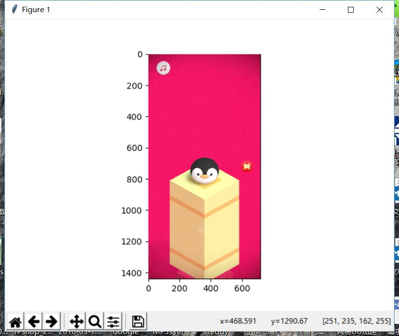

# 用python玩腾讯QQ新年游戏穿越福城 #
## 原理说明 ##
利用ADB工具获取手机截屏 
利用颜色与图案识别下一个方块所在位置,然后计算企鹅与下一方块的距离 
利用距离与板子的增长速度算出按压屏幕的时间 
最后利用ADB工具点击屏幕 

  
快过年了没什么时间编程 所以不确定什么时候能做完这个东西
 
##测试版说明
手机用数据线连接电脑，安装adb驱动，手机开启usb调试（一定要记得勾选模拟点击！！！） 
电脑安装好python3和requirements.txt中的全部包 
windos电脑按win+r输入cmd点击确定 
cd 到项目目录下输入 
	python Crossing_FuCheng_test.py
 然后会看到一个图形界面如下图 

 点击起点位置，然后点击下一个方块的中心，可以计算出两者之间的距离，初步估计一个速度V，由D=V*T得出T=D/V。
 经过初步的测试我得出1/V在2.2到2.5左右。

   
测试的时候我发现一个问题，就是这TM是个3d游戏距离随着放块的大小有所放缩，距离越远需要的点击时间越长。  真令人头大。。。
 
有好的想法或者发现有bug都可以给我发邮件哦 
**qihoo2017@gmail.com**